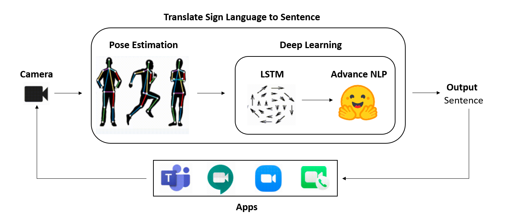

# Sign Language Translation

## 🚀 Overview  
1. Helps Deaf people while communicating
2. Unique speech to text converter where speech is in form of sign language
3. It takes sign language video as an input and converts to English sentence

## 📂 Architecture

## 🚀 Steps for running the software
Step 1: Run command - pip install -r requirements.txt
Step 2: Run command - python predict_sentences.py
Step 3: Run command - python inference.py